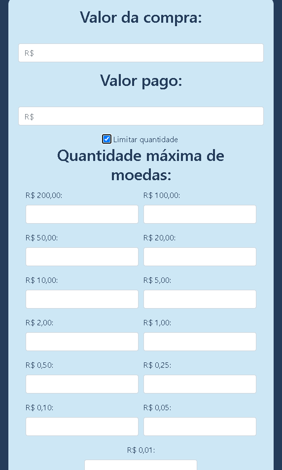
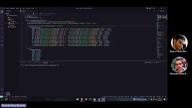

# Contexto

**Número da Lista**: 12 
**Conteúdo da Disciplina**: Algorítmos Ambiciosos 

## Alunos
|Matrícula | Aluno |
| -- | -- |
| 18/0119231  |  Eduardo Maia Rezende |
| 17/0107426  |  Kayro César Silva Machado |

## Sobre 
O projeto web "OptiCash" é uma aplicação que utiliza o algoritmo trocador para calcular o troco em transações financeiras. Com uma interface intuitiva, os usuários inserem o valor da compra e o valor pago. É possível limitar a quantidade de moedas disponíveis. O algoritmo calcula a quantidade ideal de cada denominação monetária e exibe o resultado. O "OptiCash" é uma solução prática e eficiente, facilitando o processo de troco de forma rápida e precisa.

## Screenshots

## Video de Apresentação

## Instalação 
**Linguagem**: Javascript 

### Passo 1:
Execute o arquivo index.html em seu navegador de preferência, ou acesse este link [OptiCash](https://projeto-de-algoritmos.github.io/Greed_OptiCash/)
>Nota: A aplicação tem limite de usuários simultâneos limitados.
## Uso
### Passo 1:
Insira o valor da compra.

### Passo 2:
Insira o valor do pagamento.

### Passo 3:
Limite ou não o número de notas ou moedas que serão utilizadas.

### Passo 4:
Clique em calcular.

